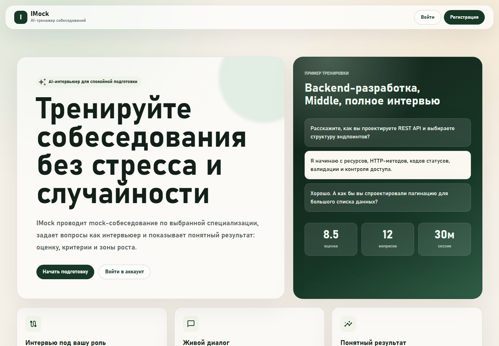

# IMock

IMock - веб-сервис для проведения технических mock-собеседований с AI-интервьюером. В отличие от обычного чата, система работает через банк вопросов: администратор создаёт типы собеседований и вопросы, а пользователь проходит интервью по сохранённым вопросам, эталонным ответам и критериям оценки.

Проект подготовлен как рабочий продукт и демонстрационный материал для ВКР.

## Возможности

- Регистрация и авторизация пользователей.
- Роль администратора для управления типами собеседований и банком вопросов.
- Автоматическое создание production-admin из env-переменных.
- Создание типов собеседований: роль, стек, уровни, количество вопросов.
- Генерация вопросов через LLM или локальный mock-режим.
- Прохождение интервью пользователем.
- Уточняющие вопросы AI-интервьюера по текущему вопросу.
- Итоговая оценка интервью: общий балл, корректность, полнота, глубина, коммуникация, сильные стороны, слабые стороны и рекомендации.
- Docker-сборка для локальной разработки, production-проверки и облачного запуска.
- CI-сборка Docker-образов через GitHub Actions и публикация в GitHub Container Registry.

## Стек

- Backend: Python, FastAPI, async SQLAlchemy, SQLite, JWT.
- Frontend: React, TypeScript, Vite, Material UI.
- LLM: локальный `mock`-режим и режим `yandex_agents` через Yandex AI Studio Responses API.
- Containers: Docker, Docker Compose, nginx для production frontend.
- Registry: GitHub Container Registry (`ghcr.io`).

## Архитектура

В production/cloud проект запускается двумя контейнерами:

```text
frontend container -> nginx + React static
backend container  -> FastAPI + SQLite + LLM client
```

Наружу публикуется только frontend:

```text
http://<server>
```

Backend доступен внутри Docker-сети:

```text
backend:8000
```

API-запросы идут через nginx:

```text
browser -> /api/v1/... -> frontend nginx -> backend:8000/api/v1/...
```

Поэтому frontend image не привязан к IP или домену сервера. В React по умолчанию используется относительный API base URL:

```text
/api/v1
```

## LLM-режимы

Проект поддерживает два режима.

### Mock

```env
LLM_MODE=mock
```

Локальный режим без внешних API-запросов. Используется для тестов, разработки и демонстрации без расходов на LLM.

### Yandex AI Studio

```env
LLM_MODE=yandex_agents
```

Production-режим через Yandex AI Studio Responses API.

В backend есть три логических LLM-сценария:

- `YANDEX_QUESTION_AGENT_MODEL` - генерация банка вопросов.
- `YANDEX_INTERVIEW_AGENT_MODEL` - ответ AI-интервьюера в ходе интервью.
- `YANDEX_REVIEW_AGENT_MODEL` - итоговая оценка интервью.

Значение model должно быть именно model URI, например:

```env
gpt://<folder-id>/yandexgpt-5.1/latest
```

Не используйте короткий идентификатор текстового агента вида `fvt...`: Yandex Responses API вернёт `Invalid model URI`.

Важно: strict JSON schema и tools/Web Search нельзя использовать одновременно в одном вызове Responses API. Текущая реализация использует strict JSON schema, поэтому Web Search для этих вызовов не включается.

## Администратор

Production-admin создаётся автоматически при старте backend, если заданы env-переменные:

```env
ADMIN_EMAIL=admin@example.com
ADMIN_PASSWORD=123
ADMIN_FULL_NAME=Администратор IMock
```

При запуске backend:

1. Создаёт или синхронизирует таблицы.
2. Ищет пользователя по `ADMIN_EMAIL`.
3. Если пользователя нет, создаёт его.
4. Выставляет `role=admin`, `is_superuser=True`, `is_active=True`.
5. Обновляет пароль из `ADMIN_PASSWORD`.

Для учебного production-запуска можно входить:

```text
admin@example.com / 123
```

Demo seed больше не нужен для создания администратора.

## Env-файлы

Реальные env-файлы с секретами не коммитятся.

```text
backend/.env          локальный backend/dev env
.env.prod            локальная production-проверка через docker-compose-prod.yaml
.env.cloud           облачный запуск готовых GHCR-образов
```

Шаблоны можно коммитить:

```text
backend/.env.example
.env.prod.example
.env.cloud.example
```

### backend/.env

Используется при локальном запуске backend и dev compose.

```env
PROJECT_NAME=IMock
API_V1_STR=/api/v1
DATABASE_URL=sqlite+aiosqlite:///./imock.db
SECRET_KEY=change-me-in-local-env
ACCESS_TOKEN_EXPIRE_MINUTES=10080
BACKEND_CORS_ORIGINS=http://localhost:5173,http://127.0.0.1:5173

ADMIN_EMAIL=admin@example.com
ADMIN_PASSWORD=123
ADMIN_FULL_NAME=Администратор IMock

LLM_MODE=mock
YANDEX_FOLDER_ID=
YANDEX_API_KEY=
YANDEX_AI_STUDIO_BASE_URL=https://ai.api.cloud.yandex.net/v1
YANDEX_QUESTION_AGENT_MODEL=
YANDEX_INTERVIEW_AGENT_MODEL=
YANDEX_REVIEW_AGENT_MODEL=
YANDEX_AGENTS_TIMEOUT_SECONDS=60
YANDEX_AGENT_STORE_RESPONSES=false
```

### .env.prod

Используется для локальной production-сборки через `docker-compose-prod.yaml`.

### .env.cloud

Используется на сервере для `docker-compose.cloud.yaml`.

Обязательные cloud-поля:

```env
BACKEND_IMAGE=ghcr.io/ser4ey/imockinterview-backend:latest
FRONTEND_IMAGE=ghcr.io/ser4ey/imockinterview-frontend:latest
FRONTEND_PORT=80
```

Для другого GitHub-репозитория формат такой:

```env
BACKEND_IMAGE=ghcr.io/<owner-lowercase>/<repo-lowercase>-backend:latest
FRONTEND_IMAGE=ghcr.io/<owner-lowercase>/<repo-lowercase>-frontend:latest
```

## Локальный запуск без Docker

### Backend

```powershell
cd backend
python -m venv venv
.\venv\Scripts\Activate.ps1
pip install -r requirements.txt
Copy-Item .env.example .env
python -m uvicorn app.main:app --reload
```

Backend будет доступен:

```text
http://localhost:8000
```

### Frontend

```powershell
cd frontend
npm install
Copy-Item .env.example .env
npm run dev
```

Frontend будет доступен:

```text
http://localhost:5173
```

## Docker Compose

В проекте есть три compose-файла.

### docker-compose.yml

Dev compose для локальной разработки.

Особенности:

- Монтирует локальные `backend/` и `frontend/`.
- Backend использует `backend/.env`.
- Frontend запускается через Vite dev-server.
- Подходит для разработки, не для облака.

Запуск:

```powershell
docker compose -f docker-compose.yml up -d --build
```

Остановить:

```powershell
docker compose -f docker-compose.yml down
```

Логи:

```powershell
docker compose -f docker-compose.yml logs -f
```

### docker-compose-prod.yaml

Локальная production-проверка.

Особенности:

- Собирает `imock-backend:prod` из `backend/Dockerfile`.
- Собирает `imock-frontend:prod` из `frontend/Dockerfile`.
- Frontend отдаётся через nginx.
- Backend запускается без `--reload`.
- Backend не публикуется наружу.
- API проксируется nginx по `/api/v1`.
- SQLite хранится в volume `imock_sqlite_data`.

Запуск:

```powershell
docker compose -f docker-compose-prod.yaml --env-file .env.prod up -d --build
```

Приложение:

```text
http://localhost
```

Пересобрать после изменений:

```powershell
docker compose -f docker-compose-prod.yaml --env-file .env.prod up -d --build
```

Пересобрать только backend:

```powershell
docker compose -f docker-compose-prod.yaml --env-file .env.prod up -d --build backend
```

Пересобрать только frontend:

```powershell
docker compose -f docker-compose-prod.yaml --env-file .env.prod up -d --build frontend
```

Логи:

```powershell
docker compose -f docker-compose-prod.yaml --env-file .env.prod logs -f
```

Сбросить SQLite volume:

```powershell
docker compose -f docker-compose-prod.yaml --env-file .env.prod down -v
```

### docker-compose.cloud.yaml

Cloud compose для сервера.

Особенности:

- Ничего не собирает.
- Скачивает готовые images из GHCR.
- Использует `.env.cloud`.
- На сервере не нужны исходники `backend/` и `frontend/`.
- Нужны только `docker-compose.cloud.yaml` и `.env.cloud`.

Запуск на сервере:

```bash
docker compose -f docker-compose.cloud.yaml --env-file .env.cloud pull
docker compose -f docker-compose.cloud.yaml --env-file .env.cloud up -d
```

Обновить после нового GitHub Actions build:

```bash
docker compose -f docker-compose.cloud.yaml --env-file .env.cloud pull
docker compose -f docker-compose.cloud.yaml --env-file .env.cloud up -d
```

Логи:

```bash
docker compose -f docker-compose.cloud.yaml --env-file .env.cloud logs -f
```

Остановить:

```bash
docker compose -f docker-compose.cloud.yaml --env-file .env.cloud down
```

Сбросить SQLite volume:

```bash
docker compose -f docker-compose.cloud.yaml --env-file .env.cloud down -v
```

## SQLite

В dev-режиме база может лежать в `backend/imock.db`.

В production/cloud база хранится в Docker volume:

```text
imock_sqlite_data
```

Внутри backend-контейнера:

```text
/app/data/imock.db
```

Данные сохраняются при перезапуске и пересборке контейнеров. Они удаляются только при удалении volume через `down -v`.

## Demo seed

Для создания демонстрационных типов интервью, вопросов и истории можно выполнить:

```powershell
docker compose -f docker-compose-prod.yaml --env-file .env.prod run --rm backend python scripts/seed_demo.py
```

Для cloud:

```bash
docker compose -f docker-compose.cloud.yaml --env-file .env.cloud run --rm backend python scripts/seed_demo.py
```

Seed создаёт demo-пользователя:

```text
user@example.com / user123
```

Seed-скрипт также upsert-ит demo-admin:

```text
admin@example.com / admin123
```

Это демонстрационный сценарий. Если в production-env указан тот же `ADMIN_EMAIL`, seed может временно заменить пароль администратора на `admin123`. При следующем старте backend bootstrap снова синхронизирует администратора из `ADMIN_EMAIL` и `ADMIN_PASSWORD`. Для реального cloud-запуска основным источником admin-доступа должны быть env-переменные, а не seed.

## GitHub Actions и GHCR

Workflow:

```text
.github/workflows/docker-images.yml
```

Запускается:

- при push в `main`;
- при push в `master`;
- вручную через `workflow_dispatch`.

Действия workflow:

1. Checkout репозитория.
2. Login в GitHub Container Registry через `GITHUB_TOKEN`.
3. Сборка backend image из `./backend`.
4. Сборка frontend image из `./frontend`.
5. Push images в `ghcr.io`.

Для репозитория:

```text
https://github.com/Ser4ey/IMockInterview
```

Имена образов:

```text
ghcr.io/ser4ey/imockinterview-backend:latest
ghcr.io/ser4ey/imockinterview-frontend:latest
```

Также создаются commit-теги:

```text
ghcr.io/ser4ey/imockinterview-backend:sha-<commit>
ghcr.io/ser4ey/imockinterview-frontend:sha-<commit>
```

Если package в GHCR private, на сервере нужно выполнить login:

```bash
echo "<github_pat_with_read_packages>" | docker login ghcr.io -u Ser4ey --password-stdin
```

## Развёртывание в Яндекс.Облаке

Рекомендуемый сценарий:

1. Создать VM в Yandex Compute Cloud.
2. Установить Docker и Docker Compose.
3. Открыть входящие порты:
   - `22/tcp` для SSH;
   - `80/tcp` для frontend.
4. Скопировать на сервер:
   - `docker-compose.cloud.yaml`;
   - `.env.cloud`.
5. Выполнить pull и запуск.

Установка Docker на Ubuntu VM:

```bash
curl -fsSL https://get.docker.com | sudo sh
sudo usermod -aG docker $USER
newgrp docker
docker version
docker compose version
```

Папка проекта на сервере:

```bash
mkdir -p ~/imockinterview
cd ~/imockinterview
```

Запуск:

```bash
docker compose -f docker-compose.cloud.yaml --env-file .env.cloud pull
docker compose -f docker-compose.cloud.yaml --env-file .env.cloud up -d
```

Проверка:

```bash
docker compose -f docker-compose.cloud.yaml --env-file .env.cloud ps
docker compose -f docker-compose.cloud.yaml --env-file .env.cloud logs -f
```

Приложение будет доступно:

```text
http://<server-ip>
```

## Проверки

Backend:

```powershell
cd backend
$env:LLM_MODE='mock'
.\venv\Scripts\python.exe -m unittest discover -s tests
```

Frontend:

```powershell
cd frontend
npm run build
```

Docker production build:

```powershell
docker compose -f docker-compose-prod.yaml --env-file .env.prod build backend frontend
```

Compose config:

```powershell
docker compose -f docker-compose-prod.yaml --env-file .env.prod config --quiet
docker compose -f docker-compose.cloud.yaml --env-file .env.cloud config --quiet
```

## Важно

- Не коммитьте реальные `.env`, `.env.prod`, `.env.cloud`.
- Не коммитьте API-ключи Yandex.
- Не запекайте секреты в Docker images.
- Не копируйте локальную SQLite-базу в image.
- Backend image и frontend image должны быть собраны без локального `venv`, `node_modules`, `dist` и `.env`.
- Для этого используются `backend/.dockerignore` и `frontend/.dockerignore`.
- В проекте нет тарифов, оплат, Free/Pro/Premium и коммерческих ограничений. Технические лимиты используются только как защита от неконтролируемого расходования LLM API.
